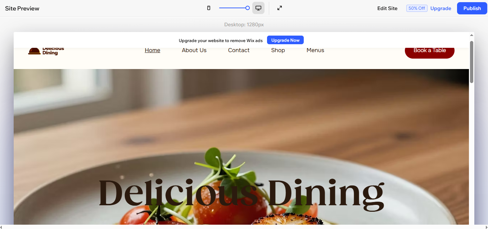
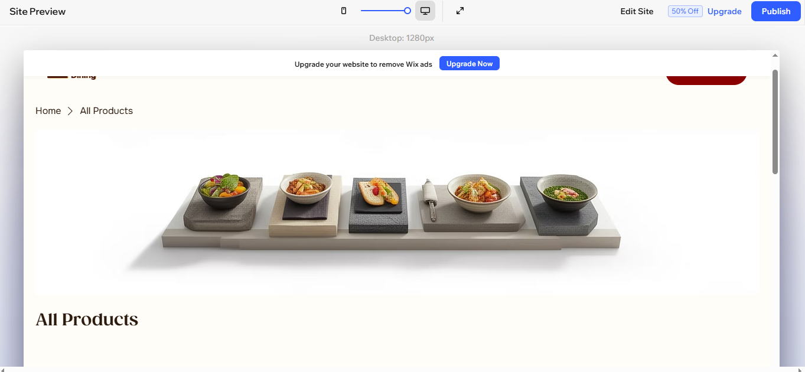
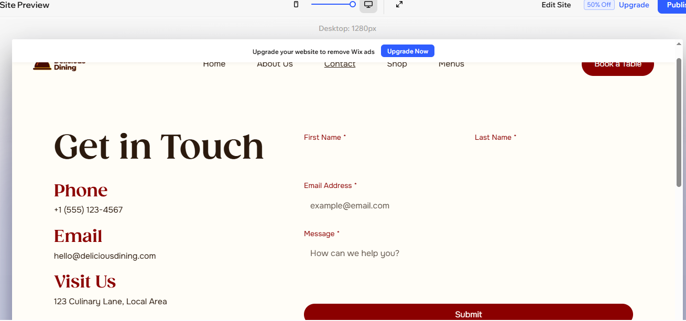
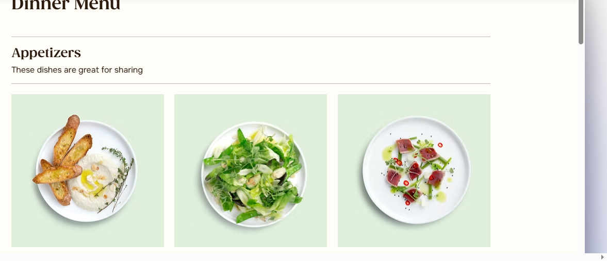
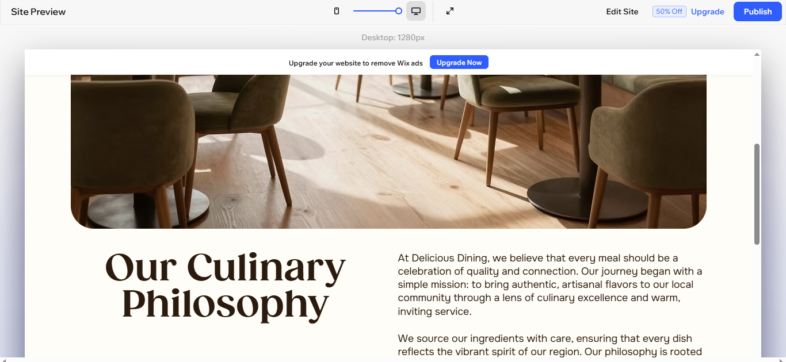

# 🍽️ Delicious Dining

## Student Information

| Field | Details |
|---------|---------|
| Student Name | Kenny Eduin REBERO Ikuzo |
| Student ID | 23927/2024 |
| Department | Software Engineering |
| Course | E-Commerce And Web Application (EWA408510) |
| Lecturer | Eric Maniraguha |
| Academic Year | 2025-2026 |
| Semester | II |
| Project Type | Individual Project |
| Platform Used | Wix |

---

# 📌 Project Title

## Delicious Dining – Online Food Ordering and Restaurant E-Commerce Website

---

# 📖 Project Description

Delicious Dining is a modern e-commerce website developed using the Wix no-code platform. The website allows customers to browse food products, view prices and descriptions, add items to a shopping cart, and contact the restaurant through an online form.

The platform was designed to provide a convenient and enjoyable online food ordering experience while demonstrating the practical application of e-commerce concepts and website design principles.

---

# 🎯 Project Objectives

The objectives of this project are:

- To design a professional e-commerce website using a no-code platform.
- To apply modern UI/UX principles.
- To create a user-friendly online food ordering platform.
- To provide customers with product browsing and cart functionality.
- To practice GitHub repository management and Markdown documentation.

---

# 🛠️ Platform Used

- Wix Website Builder
- GitHub
- Markdown Documentation

---

# ✨ Features Implemented

## 🏠 Homepage

The homepage includes:

- Delicious Dining logo
- Welcome message
- Hero banner section
- Featured meals
- Promotional offers
- Navigation menu
- Footer section

---

## 🍔 Product Page

The product page displays food items with:

- Product images
- Product names
- Product descriptions
- Product prices
- Add-to-cart buttons

### Products Available

| Product | Price |
|----------|--------|
| Beef Burger | $8 |
| Chicken Pizza | $12 |
| Grilled Chicken | $10 |
| Fresh Juice | $4 |
| Chocolate Cake | $6 |

---

## 🛒 Shopping Cart

The website includes:

- Add-to-cart simulation
- Product quantity selection
- Cart review section
- Order summary

---

## ℹ️ About Page

The About page contains:

### Our Mission

To provide delicious, affordable, and high-quality meals while delivering excellent customer service.

### Our Vision

To become a leading online restaurant and food delivery service by offering convenient and enjoyable dining experiences.

---

## 📞 Contact Page

The Contact page includes:

- Contact form
- Email address
- Phone number
- Business address
- Customer support information

---

## 📱 Responsive Design

The website is optimized for:

- Desktop Computers
- Tablets
- Smartphones

---

## 🔗 Social Media Integration

The website includes links to:

- Facebook
- Instagram
- WhatsApp
- X (Twitter)

---

# 🎨 UI/UX Design Considerations

The website was designed following these principles:

- Simplicity
- Consistency
- Visibility
- User-Friendly Navigation
- Attractive Layout
- Responsive Design
- Accessibility

---

# 📂 Website Structure

```text
Home
│
├── Featured Products
├── Promotions
│
Products
│
├── Burgers
├── Pizza
├── Chicken
├── Drinks
├── Desserts
│
About
│
Contact
│
Cart
```

---

# 📸 Screenshots

## Homepage



---

## Product Page



---

## Contact Page



---

## Cart Page



---

## About Page



---

# 🚧 Challenges Encountered

During the development of this project, several challenges were encountered:

1. Selecting the most suitable Wix template.
2. Organizing products effectively.
3. Designing an attractive homepage.
4. Maintaining a consistent layout across pages.
5. Managing image quality and sizing.
6. Ensuring responsive design on different devices.
7. Customizing Wix components to fit the restaurant theme.

---

# 📚 Lessons Learned

Through this project, I learned:

- How to build an e-commerce website using Wix.
- Website planning and organization.
- UI/UX design principles.
- Product management and presentation.
- Shopping cart implementation.
- Responsive web design.
- GitHub repository management.
- Markdown documentation.
- Importance of customer-centered website design.

---

# 📁 Repository Structure

```text
Delicious-Dining/
│
├── README.md
│
└── Images/
    ├── Homescreen.png
    ├── Productscreen.png
    ├── Contactscreen.png
    ├── Cartscreen.png
    └── Aboutscreen.png
```

---

# 🌐 Live Website Link

Website URL:

https://YOUR-WIX-WEBSITE-LINK

Example:

https://deliciousdining.wixsite.com/delicious-dining

---

# 💻 GitHub Repository Link

Repository URL:

https://github.com/YOUR-USERNAME/Delicious-Dining

---

# ✅ Project Requirements Checklist

| Requirement | Status |
|------------|---------|
| Homepage | ✔️ Completed |
| Product Page | ✔️ Completed |
| Minimum 5 Products | ✔️ Completed |
| About Page | ✔️ Completed |
| Contact Page | ✔️ Completed |
| Cart Interaction | ✔️ Completed |
| GitHub Repository | ✔️ Completed |
| README.md Documentation | ✔️ Completed |
| Screenshots Included | ✔️ Completed |
| Live Website Link | ✔️ Completed |

---

# 🏆 Conclusion

The Delicious Dining website successfully demonstrates the use of a no-code platform to create a functional e-commerce website. The project includes essential e-commerce features such as product display, shopping cart interaction, contact functionality, responsive design, and user-friendly navigation.

This project enhanced my practical skills in website development, UI/UX design, e-commerce concepts, GitHub repository management, and Markdown documentation.

---

## 👨‍💻 Author

**Kenny Eduin REBERO Ikuzo**

Software Engineering Student

University of Lay Adventists of Kigali (UNILAK)

Academic Year: 2025–2026
